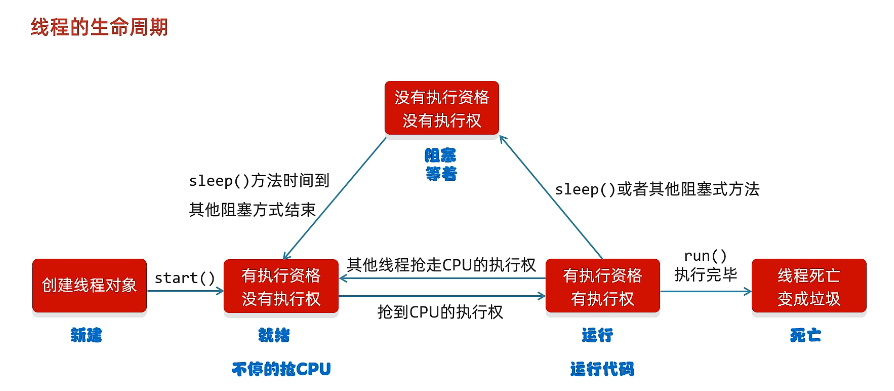

# Java多线程

## 多线程的概念

- **进程**：程序的基本执行实体（例如电脑中运行的某个软件）
- **线程**：线程是操作系统能够运算调度的最小单位。它被包含在进程中，是**进程**的实际运作单位。

- **多线程**：程序同时执行多个任务；
- **并发**(`concurrent`)指在java程序中同时运行多个线程；（同一时刻，多个指令在**单个CPU**上**交替执行；**）
- **并行**：同一时刻，多个指令在**多个CPU**上**同时执行；**

## 多线程的实现方式

- 实现方式一：自己定义一个继承自`Thread`的类，重写`run`方法；

  ```java
  public class Thread1 extends Thread{
      @Override
      public void run() {
          for(int i=0;i<10;i++){
              System.out.println(getName() +" hello world!");
          }
      }
  }
  
  // 测试
  public class MyThread {
      public static void main(String[] args) {
          Thread1 t1 = new Thread1();
          t1.setName("线程1");
          Thread1 t2 = new Thread1();
          t2.setName("线程2");
  
          t1.start();
          t2.start();
  
      }
  }
  // 运行结果
  线程2 hello world!
  线程1 hello world!
  线程1 hello world!
  线程1 hello world!
  线程1 hello world!
  线程2 hello world!
  线程2 hello world!
  线程2 hello world!
  线程1 hello world!
  线程2 hello world!
  线程1 hello world!
  线程2 hello world!
  线程1 hello world!
  线程2 hello world!
  线程1 hello world!
  线程2 hello world!
  线程1 hello world!
  线程2 hello world!
  线程1 hello world!
  线程2 hello world!
  ```

- 实现方式二：

    - 自己定义一个类实现`Runnable`接口，重写`run`方法；
    - 创建一个自己类的对象，创建Thread类的对象，并开启线程；

  ```java
  public class Thread2 implements Runnable{
      @Override
      public void run() {
          String name = Thread.currentThread().getName();//获取当前线程的name
          for(int i=0;i<10;i++){
              System.out.println(name +" hello world!");
          }
      }
  }
  
  // 测试
  public class MyThread {
      public static void main(String[] args) {
          Thread2 thread = new Thread2();
          
          Thread t1 = new Thread(thread);
          Thread t2 = new Thread(thread);
          t1.setName("线程1");
          t2.setName("线程2");
  
          t1.start();
          t2.start();
      }
  }
  ```

- 实现方式三：

    - 创建一个类实现`Callable`接口，重写`call`方法（有返回值，表示多线程的运行结果）；
    - 创建自己类的对象；
    - 创建`FutureTask`对象（用于管理多线程处理的结果）；
    - 创建`Thread`类的对象，并启动线程；

  ```java
  public class Thread3 implements Callable<Integer> {
      @Override
      public Integer call() throws Exception {
          int sum = 0;
          for(int i=0;i<10;i++){
              sum += i;
          }
          return sum;
      }
  }
  
  // 测试
  public class MyCallable {
      public static void main(String[] args) {
          Thread3 thread = new Thread3();
          
          FutureTask<Integer> f = new FutureTask<>(thread);
          
          Thread t1 = new Thread(f);
          Thread t2 = new Thread(f);
          t1.setName("线程1");
          t2.setName("线程2");
  
          t1.start();
          t2.start();
      }
  }
  ```

## 多线程的常用方法

```java
public final void setName(String name); // 更改线程的名字
public final String getName(); // 获取线程的名字
public void start(); // 启动线程
public static Thread currentThead(); // 获取正在执行的线程
public final int getPriority(); // 获取当前线程优先级
public final void setPriority(int newPriority); //设置线程的优先级（1~10）
public static void sleep(long millis); // 睡眠指定时间，暂停运行
public final void join(long millis); // 插入线程
public static void yield(); //礼让线程
```

## 线程的生命周期



## 线程的安全问题

- 竞态条件（Race Condition）

    - 多个线程同时对**共享资源**进行读写操作，导致数据不一致。
    - 解决：同步机制（synchronized），锁（Lock），使用线程安全的数据结构（如ConcurrentHashMap）
    - 同步代码块
        - **锁对象一定要是唯一的**，如果每个线程拥有一个不同的锁对象，则锁就失去了意义；
        - synchronized不要写在循环内，不然一个线程抢到执行权后，直到循环结束之前，其他线程没法进入；

  ```java
  //注：这里使用线程的第一种自定义方法
  public class MyThread extends Thread{
      
      // 加static关键字，表示共享ticket数据
      static int ticket = 0; 
  
      // 锁对象必须是唯一的
      // 加static关键字表示的MyThread创建的所有对象都共享同一个obj
      static Object obj = new Object();
  
      @Override
      public void run() {
          while(true){
              // 同步代码块
              synchronized (obj){
                  if(ticket<100){
                      try {
                          Thread.sleep(100);
                      } catch (InterruptedException e) {
                          throw new RuntimeException(e);
                      }
                      ticket++;
                      System.out.println(getName()+"正在卖第"+ticket+"张票！");
                  }else{
                      break;
                  }
              }
          }
      }
  }
  ```

    - 同步方法
        - 将同步代码块抽取出来形成一个方法，为这个方法上锁；

  ```java
  //注：这里使用线程的第二种自定义方法
  public class MyRunnable implements Runnable{
      int ticket = 0;// 不需要static关键字，Runnable对象只创建一次
  
      @Override
      public void run() {
          while(true){
              if(memthod()) break;
          }
      }
  
      // 同步方法
      private synchronized boolean memthod() {
          if(ticket<100){
              try {
                  Thread.sleep(100);
              } catch (InterruptedException e) {
                  throw new RuntimeException(e);
              }
              ticket++;
              System.out.println(Thread.currentThread().getName()+"正在卖第"+ticket+"张票！");
          }else{
              return true;
          }
          return false;
      }
  }
  ```

- **StringBulider**&**StringBuffer**

    - `StringBuffer`和`StringBuilder`都是Java中用于处理**可变字符串**的类，它们的主要区别在于线程安全性和性能。

    - `StringBuffer`是**线程安全**的，因此可以在多线程环境下使用。它的**所有公共方法都是同步的**
      ，即在方法内部使用了synchronized关键字来确保线程安全。这种同步机制会带来一定的**性能损失**
      ，因为多个线程需要竞争同一把锁，这会导致线程阻塞和上下文切换。因此，如果不需要在多线程环境下使用可变字符串，建议使用`StringBuilder`。
    - `StringBuilder`是**非线程安全**
      的，因此不能在多线程环境下使用。它的所有公共方法都不是同步的，因此在单线程环境下使用`StringBuilder`
      比使用`StringBuffer`更加高效。

- **锁（Lock）**

  ```java
  public class MyThread extends Thread{
      static int ticket = 0;
      static Lock lock = new ReentrantLock();
      @Override
      public void run() {
          while (true) {
              lock.lock(); // 上锁
              try {
                  if (ticket < 100) {
                      Thread.sleep(100);
                      ticket++;
                      System.out.println(getName() + "正在卖第" + ticket + "张票！");
                  } else {
                      break;
                  }
              } catch (InterruptedException e) {
                  throw new RuntimeException(e);
              } finally {
                  lock.unlock(); // 释放锁 
                                 // 使用finally关键字，不管怎样都会被执行，防止线程跳出循环后未释放锁
              }
          }
      }
  }
  ```

- **死锁**

    - 死锁是指两个或多个线程在互相持有对方所需要的资源时，都在等待对方先释放资源，导致程序无法继续执行的情况。
    - 避免死锁的方法：
        - 避免使用多个锁：尽量减少线程需要持有的锁的数量，或使用更高级别的同步机制（如ReentrantLock）来避免死锁；
        - 避免使用多个锁的嵌套；
        - 超时等待：线程尝试获取锁时，设置一个超时时间，在等待超过一定时间后，放弃获取锁。

- **等待唤醒机制**

    - 等待唤醒机制是一种用于线程间通信的机制，它允许一个线程等待另一个线程的通知，以便在特定时间点上恢复执行。

    - 常用方法：

      ```java
      void wait();
      void notify();
      void notifyAll();
      ```

## 线程池

- 之前写多线程的弊端：线程用完之后就消失，浪费资源；
- 线程池是一种用于**管理和重用线程**的机制，它允许在应用程序中创建一组线程，并在需要时执行任务，而不需要频繁地创建和销毁线程。
- 线程池核心原理：
    - 创建一个池子，初始是空的；
    - 提交任务时，池子创建一个新的线程对象，任务执行完毕后把线程还给池子，下次创建线程时不需要创建新的线程，直接复用已有的线程；
    - 但是如果提交任务时线程池中没有空闲线程，也无法创建新的线程，任务就会等待；

```java
public class ThreadPoolDemo {
    public static void main(String[] args) {

        // 创建一个没有上限的线程池对象
//        ExecutorService pool = Executors.newCachedThreadPool();

        // 创建一个有上限的线程池对象
        ExecutorService pool = Executors.newFixedThreadPool(3);

        // 提交任务
        pool.submit(new MyThread());
        pool.submit(new MyThread());

        // 销毁线程池
        pool.shutdown();
    }
}
```

